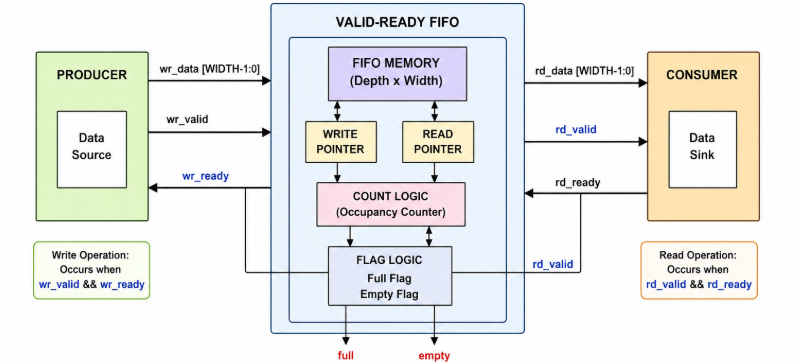
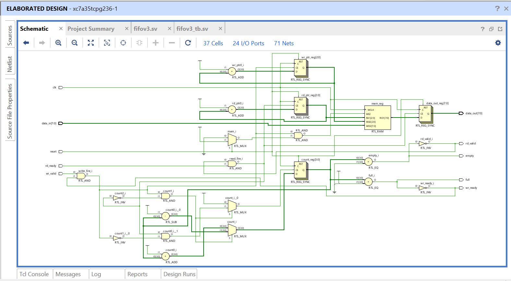
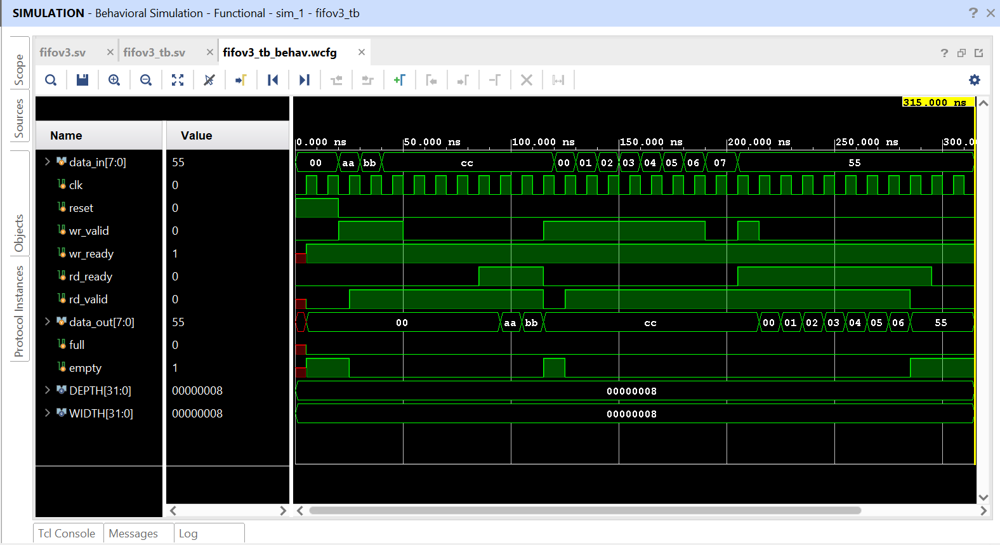

# FIFO V3 – Valid-Ready Handshake FIFO (SystemVerilog)

## Overview
This project implements a **parameterizable synchronous FIFO** using the **Valid-Ready Handshake Protocol** in SystemVerilog.
Unlike a conventional FIFO that relies on `wr_en` and `rd_en` signals, this design uses a producer-consumer handshake mechanism, making it suitable for modern digital systems and streaming interfaces.

The FIFO supports:
- Parameterizable data width and depth
- Valid-Ready handshaking
- Simultaneous read and write operations
- Circular buffer implementation
- Full and Empty status detection
- Back-pressure support
- SystemVerilog RTL and verification environment

---

## Features

### Write Interface
| Signal | Description |
|----------|-------------|
| `wr_valid` | Producer indicates valid data is available |
| `wr_ready` | FIFO indicates space is available |

A write occurs only when:
```text
wr_valid && wr_ready
```

### Read Interface

| Signal | Description |
|----------|-------------|
| `rd_valid` | FIFO indicates valid data is available |
| `rd_ready` | Consumer is ready to receive data |

A read occurs only when:
```text
rd_valid && rd_ready
```

---

## FIFO Architecture

The FIFO is implemented using:
- Memory Array (`mem`)
- Write Pointer (`wr_ptr`)
- Read Pointer (`rd_ptr`)
- Occupancy Counter (`count`)

Status flags:
```text
full  = (count == DEPTH)
empty = (count == 0)
```

Handshake signals:
```systemverilog
assign wr_ready = !full || (rd_ready && rd_valid);
assign rd_valid = !empty;
```

---

## Block Diagram


---

## RTL Schematic


---

## Project Structure
```text
fifo_v3/
│
├── fifov3.sv                                     # FIFO RTL
├── fifov3_tb.sv                                  # Testbench
├── block_diagram.png                             # Architectural block diagram
├── rtl_schematic.png                             # Vivado RTL schematic
├── fifo_v3_simulation.png                        # Simulation waveform
|__ console_output1.png and console_output2.png   #TCL Console results 
└── README.md
```

---

## Simulation

### Test Cases Covered

### 1. Basic Write Operation

Data sequence written into FIFO:

```text
AA → BB → CC
```

### 2. Basic Read Operation

Data is read in FIFO order:

```text
AA → BB → CC
```

verifying First-In-First-Out behavior.

### 3. Consumer Not Ready

```text
rd_valid = 1
rd_ready = 0
```

FIFO retains data until the consumer becomes ready.

### 4. FIFO Full Condition

```text
wr_ready = 0
```

Back-pressure is generated, preventing additional writes.

### 5. Simultaneous Read and Write

```text
wr_valid = 1
wr_ready = 1

rd_valid = 1
rd_ready = 1
```

Read and write occur in the same clock cycle while maintaining FIFO occupancy.

### 6. Pointer Wrap-Around

Write and read pointers correctly wrap around the circular buffer.

---

## Simulation Waveform



Observed behavior:

- Correct Valid-Ready handshake
- Proper FIFO ordering
- Full/Empty flag operation
- Simultaneous read/write support
- Circular buffer functionality

---

## Parameters

```systemverilog
parameter DEPTH = 8;
parameter WIDTH = 8;
```

| Parameter | Description |
|------------|-------------|
| DEPTH | FIFO depth |
| WIDTH | Data width |

---

## Tools Used

- SystemVerilog
- Xilinx Vivado 2025.2
- XSim Simulator

---

## Learning Outcomes

This project demonstrates:
- FIFO design fundamentals
- Valid-Ready protocol implementation
- Producer-consumer synchronization
- Back-pressure handling
- Circular buffer management
- RTL verification using SystemVerilog testbenches

---

## Future Improvements

Potential enhancements for future versions include:
- Programmable Almost Full and Almost Empty flags
- Synchronous FIFO with configurable thresholds
- Asynchronous FIFO using Gray Code pointers
- AXI-Stream compliant FIFO interface
- UVM-based verification environment

---

## Author

**Ananya Satish**  
Electronics and Communication Engineering (ECE)

**Areas of Interest:**
- Digital VLSI Design
- RTL Design & Verification
- FPGA Design
- Computer Architecture

---
